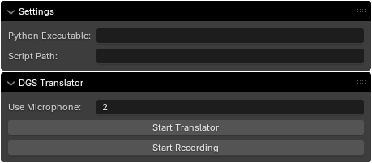

# Project SIGGI - German Sign Language Interpreter

## Installation
1. Make sure to have [Blender](https://www.blender.org/download/) installed on your system.
2. Download `SIGGI` from _**Releases**_.
3. Create a virtual environment from [pypoetry.toml](pyproject.toml).
4. Clone the repository
5. Open `SIGGI.blend`
6. In the 3D Viewport section access the tab `DGS` and open the `Settings`panel
7. Enter the path to the `python.exe` of your virtual environment and the `main2.py` script from the coloned repository
  
